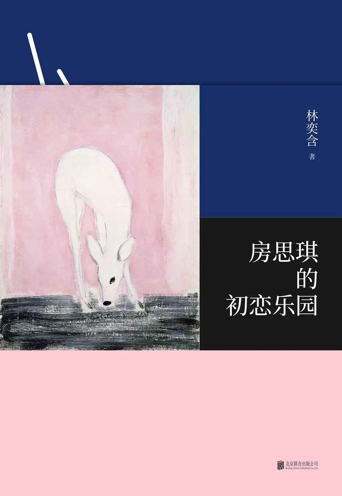
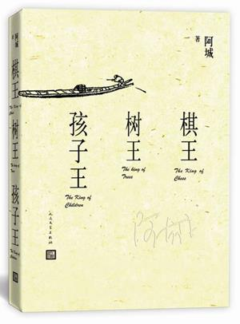
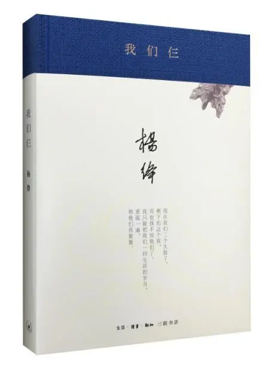

# 前言

我打小是个闷子，似乎把讲话的力气都用在哭鼻子上了，见人不敢打招呼，哭起来却有一股拼命的劲儿。

我打小也不爱看书，或者说对书很挑剔，自己爱看的饭不吃也得看完，不爱看的光翻翻目录都要歇息半天。

我打小更不爱走动，到小区门口买袋盐都要家长开导半天。

我打小也不怎么看电影，看一个侏罗纪公园回家路上都走得小心翼翼。

不过我打小就爱吃，或者说胃口很好，跟青少年的狗一样给多少吃多少。

但这些都通过各种各样的机遇成了我的一点小小的爱好。真奇妙啊。纪念一下过去，也送给将来的自己。

# 读书

我开始能看的下去书，大概是从初中开始，可真正爱读书时已经是高一，大概年纪大了更静得下心来一些，但更主要的原因还是遇上了王舒成老师。我常认为他该去大学教书，因为在现代的教育模式里长大的我也曾经自然而然地认为在高中这个时间段的语文课上大谈特谈武侠小说甚至龙族简直是违背师德，但没办法，他越说我越喜欢。不多说了，以后会专门写一写我的老师们的。总之，高一高二是我至今为止读书效率最高的两年，回想起来这真是一个奇怪的矛盾，反而自己越有时间的时候越想不起读书，反而最忙忙碌碌的两年里求书若渴。

虽然我读的书不算很少，但也自感无能无力写详细书评，所以每本书只大概说说我自己喜欢或嫌弃的地方，介绍的方式也就随心所欲一些了,也没有一个适合的顺序，印象比较深的自然放在前面，剩下的就看回忆什么时候显灵了。

## 房思琪的初恋乐园  

文学辜负了我们，真诚者以文学表达真诚，虚伪者也能用文学遮掩虚伪。一个真正相信中文的人，又怎么可以背叛者浩浩汤汤五千多年的语境···

## 素食者  

活在这珍贵的人间，人类和植物一样幸福，爱情和雨水一样幸福。这本书里容不下海子的诗，人类，远不及植物幸福。

## 白鹿原

书里的人很有人味儿。

## 文城

讲的故事有点不太像余华的作风，看这书很有种看电影的感觉，恰恰是我这个年纪最爱听的故事。

## 兄弟

荒诞而又真实，这本书里频繁出现的不太高雅的幽默，很合我的口味，看起来没有那么大心理负担。

## 活着

别像我一样在晚上看，不看完睡不着，看完了更睡不着···

## 许三观卖血记

那段时间每天想吃猪肝，看书把自己看出一种贫血的错觉。

## 小李飞刀

快，快，快。拳脚刀剑快，小李飞刀快，爱恨恩仇快，一切都快，看起来也很快。实在觉得古龙对女人有些偏见，而且故事里的人都有种横空出世的感觉，没有金庸武侠里的那种成长过程。似乎一上来就已经排好了座次，李寻欢形象还算完整，到后面叶开等人就直接石头缝里蹦出来的一样没有太多故事可言，书里的女人更是潦草，很多地方莫名其妙，也可能本身古龙眼里女人某些方面正是莫名其妙的。

## 绝代双骄

古龙的武侠小说本身就有种浓重的江湖感，游历四海每天遇见不同的人。

## 射雕英雄传

这是我第一次看金庸的小说，真的爱不释手。

## 神雕侠侣

小龙女/色/色，射雕两部曲里误会真的多，急的我都要边转圈边看。

## 倚天屠龙记

这本书是我读金庸以来最不喜欢的一本。书里张无忌整个就是一个开了挂的正直渣男形象，我不是很喜欢，基本没啥特点，
还好有我比较喜欢的小昭，不然高低骂几句。倒是魔教教主那部电影很有趣，里面的张无忌才是我心目中的形象，赵敏小昭也是美得我直傻笑，嘿嘿。

## 天龙八部

同样是开挂，这书里的人就很有个性，尤爱乔峰，真的是男人中的男人。

## 笑傲江湖

令狐冲好帅啊好帅啊

## 鹿鼎记

扬州风评被害···早知道金庸老人家藏了一手。

## 飞狐外传

金庸短一些的小说看起来不过瘾，之前看的都是四本四本的，这次两本的看了有些无感···

## 呐喊

这几乎是一本由课文组成的书，孔乙己、社戏、故乡、祥林嫂、药等等，最爱的还是鲁迅先生在社戏、故乡里夹带的一点私货，愤怒的笔尖下还是不能自已地流露出一点儿时的温情。

## 彷徨

相比呐喊，彷徨整个就是乌漆嘛黑一片。

## 野草

架子上有两本书，一本是鲁迅的书，另一本也是鲁迅的书···

## 插花地册子

爱读书的人总能产生些共鸣，虽然止庵先生品味比我高些，有些我挺喜欢的书被他批成了一坨屎。

## 美国众神

现代的神话故事，不要把之前对古代神的刻板印象代入这本书，不然完全猜不出下一步的发展。

## 雪落香杉树

不太记得种族偏见了，就记得死者某些部位又粉又大···

## 千禧三部曲

不要惹有纹身的女人  

普通人头上挨一枪原来也能活

## 汉字书法之美

小时候也练过几个月的字，十分的痛苦；但读了这本书，会感受一点汉字的趣味。

## 菊与刀

之前自以为对日本文化挺感兴趣的，读了这本书才发现自己叶公好龙了···

## 边城

也许明天回来，还是老一辈的爱情故事深得我心。为此专门出去旅行了一次，然而并未见到边城，只有充斥着商业旅游气息的凤凰古镇···

## 湘行散记

读了边城喜欢上了沈从文，结果湘行散记又把我打回原形了，读起来实在有点拗口，还好吊脚楼的故事并不少，勉强还能看下去。

## 围城

疫情封校的大学···

钱钟书的小说也不是那么好读的，对于中学时的我还是有些困难。

## 宋诗选注

《围城》我尚且读不明白，宋诗选注只能望洋兴叹了。

## 棋王树王孩子王

我唯一觉得有些美中不足的就是三个故事有点走下坡路，不过也可能是棋王那部分太精彩了。

## 干校六记

杨绛先生的书对于中学时的我绝对比钱钟书先生的书可爱多了。

## 我们仨

如果没发生这么多悲剧，这真的是我理想中的最可爱的家。

## 将饮茶

很爱杨绛先生的回忆方式，几十年千帆过尽都付谈笑间。

## 至味在人间

每一页都是满满的吃货的趣味。

## 我与地坛

史铁生的许多文字自始至终让我觉得他有一股年轻人的劲儿，却又有一种长辈的成熟与沉稳。

## 上学记

电影《无问西东》上映后看的这本书，比电影过瘾很多，那段时间还正好读了汪曾祺对于西南联大的一些回忆文，身不能至，心向往之，顿觉自己所处的学校四处围墙。

## 红拂夜奔

很黄很有趣，自此喜欢上王小波。

## 黄金时代

其实一开始读还不太能接受，对于“破鞋”，“公交车”等概念都还不甚了解···似水流年里的同性情节更是对于当年单纯的我的严重打击。

## 爱你就像爱生命

文人谈恋爱似乎也和我这俗人没太大区别。

## 百年孤独

这本书也一度想要半途而废，看着看着却又习惯了他的写法，然而看到最后奶浴水平有限还是没什么特别感受，只是又一次确认了近亲结婚是不可取的。

## 瓦尔登湖

梭罗这人有脑子，看见湖泊就高兴，然而这本书真的真的是催眠啊，那时候睡眠不好看两页瓦尔登湖直接呼呼大睡。

## 海子的诗

高一读朦胧诗，最爱的就是海子，因为他真他妈的朦胧，亚洲铜，太平洋上的贾宝玉，日记等等至今都能背上几句。他是我心目中最纯粹的那种文人，可这样的人总是容易受伤的，我想起房思琪，想起余秋雨那个为了红楼梦割腕的叔叔···

## 顾城的诗

如果说海子在我心中的形象是一个年轻的梦想家，那顾城的诗给我的感觉就一直是一个想要看看世界的懵懂少年。黑夜给了我黑色的眼睛，我却用它寻找光明。

## 北岛的诗

说了海子和顾城，北岛在我心中的形象就是一个严厉的中年人，这也是他的诗虽然很好但我总是没办法那么喜欢的原因。

## 舒婷的诗

舒婷的诗可能是当年读的主流朦胧派诗人的诗中最不朦胧的一个，也是最容易模仿的一个，那会儿装模作样写诗往往都是从舒婷这里找到灵感。

## 文化苦旅

这其实就是我说的自己本来挺喜欢但是被止庵先生批成了一坨狗屎的书。细想起来我的语文老师很不赞成的排比堆砌以及大段感叹还有为了拔高而拔高的无病呻吟都在这本书里有所体现，但我仍固执地认为这样看起来也挺快乐的，有种看同龄人优秀作文的感觉。

## 借我一生

这本书看起来很不起眼，却是余秋雨先生给我印象最好的一本了。很多人说余秋雨人品不行，具体我也不大清楚，但这本书里对那个特殊年代的记述还是能够让人共情的。

## 妞妞，一个父亲的札记

这本书里流露的感情会让人惋惜，会让人赞美，但很难让人流泪。大概这本书诞生之际，妞妞就已经是周国平先生那一段生命中的过客了。

## 福尔摩斯探案集

## 龙族

## 九州缥缈录

## 此间的少年

## 局部

## 撒哈拉的故事

## 半生缘

## 白夜行

## 嫌疑人X的献身

## 沉默的巡游

## 幻夜

## 解忧杂货铺

## 霸王别姬

## 野火集

## 目送

## 亲爱的安德烈

## 孩子，你慢慢来

## 装在口袋里的爸爸

小学时候看的，也许能算得上我第一次读科幻小说。不大记得清了，印象比较深的是一本书里讲了洗脑式教育，里面的同学们被绑上椅子，一个巨大的漏斗往脑子里输送浆糊一样的东西。

印象最深的是无所不能的大Boss被一个悖论打败了。好像讲的是他没办法找到一块自己搬不动的石头，这也是我第一次接触悖论这个东西，谁能想到若干年后这个词又要在大学课程中折磨我呢？

这一套书是我小学的最爱。

## 淘气包马小跳 男生日记 女生日记 秃尾巴狼

这套书当年被众多家长戴上少儿不宜的帽子，我却很喜欢，尤其是男生日记和女生日记两本书，可以说是我的爱情启蒙···书里我记住的东西并不多，但几个人物形象还是很清晰，有一个运动很好但说话结巴的小子，有一个废话连篇的小子，有一个练过舞蹈走路只看正前方的姑娘，还有一个姑娘好像有点傲娇···还有个羞于启齿的事，女生日记里有一幅女生乳房微微隆起时照镜子的图片，画的朦朦胧胧的但给了当时纯洁的我很多的憧憬。

少男少女朦胧的感情，同学间的友情，离异、死亡、成熟、金钱、追星等等等等，如果书中的这些内容是家长称其祸害少年的理由，我也只能为他们的孩子感到可悲。

感谢我的父母没有不准我看所谓的“禁书”，让我在和书中孩子相仿的年纪共度了生命中仅有一次的少年的一次成长。

## 沈石溪系列

我小时候没机会看迪士尼的狮子王，但沈石溪的动物小说系列补上了这个缺口。那时候一本不落的追完了整个系列，甚至看过这些书之后的我对“畜生”两个字有莫名的反感。也是这一套书，让我从一个害怕动物的孩子逐渐地学会尊敬生命、善待他人。

# 观影

## 超英

### 金刚狼1

### 金刚狼2

### 金刚狼3

### 钢铁侠1

### 钢铁侠2

### 钢铁侠3

### 美国队长1

### 美国队长2

### 美国队长3

### 雷神1

### 雷神2

### 雷神3

### 雷神4

### 奇异博士1

### 奇异博士2

## 爆米花

## 国产

## 国外

# 音乐

# 旅行

# 追番

# 百味
