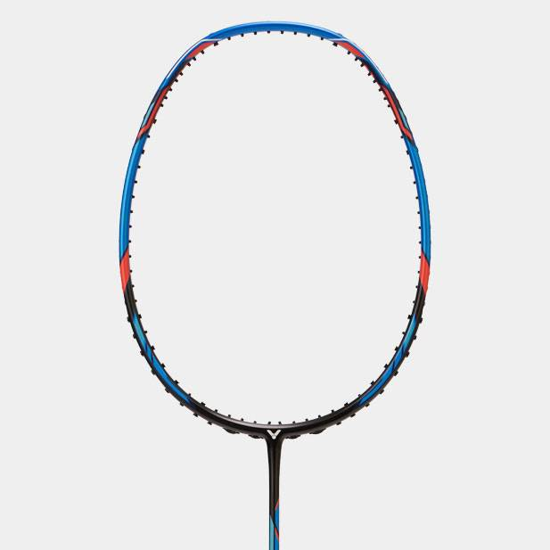

# 引言

首先，评价本身就是主观的，我也不是在做测评只是记录自己不同阶段的使用感受，偶尔回顾起来也能感受到自己的变化。就请看做志同道合者的一点牢骚吧。

# 装备

## 尤尼克斯  

### 弓11新色 3UG5 sp 1099RMB 空拍

弓11是我第一把3U规格的拍子，也是第一把高端拍，至于为什么第一把选择了她，最重要的因素还是看中了她的颜值。

刚穿完线挥动起来还是有点担忧的，并不是立马能够适应，但打了一场之后就深深爱上了。

刚入门就听说遇事不决弓11，果真名不虚传，大拍面配合冷静的脚步能接到不少第一眼以为碰不到的球。  
未完待续···

---

## 胜利 

### 小隼 蓝4UG5 cn 600RMB（包含穿线和手胶）  

这是我入的第二把中端拍，也许能算得上中高端，但使用感受却不尽人意。尤其我刚入门的时候，这把拍子在知乎、b站等等平台被宣传得神乎其神，甚至被冠以进阶拍性价比首选等等美誉。就从性价比说起，460左右的黑小隼还能跻身高性价比球拍的行列，而因为颜值和传销价格一路高歌猛进甚至售价突破600大关的蓝小隼，在我眼里已经完完全全没有性价比了。 

但不可否认的是，蓝色小隼的颜值确实说得过去，即使不算多么惊艳，也称得上百搭耐看了。  

然而，他与新手似乎并不适配，相对不大的拍框想要打中甜区，对于笨拙的我真的是难上加难。刚换上小隼的那一晚，隔几拍就能听到“悦耳”的打铁声，心疼漆水之余更是产生了前所未有的自我怀疑···

### 龙牙之刃 一代新色 3UG5 海外jp版 1180RMB 空拍

## 李宁
