# ***序***

我并非在做测评，更不是打广告，只是真实地记录下自己不同阶段的使用感受，偶尔回顾起来也能感受到成长。这一篇文章，就请各位看做一个普通爱好者的一点牢骚吧。

---

# ***选拍指南***

选拍讲究一个合适，当自己水平提高逐渐确定喜欢的打法后就可以自己挑选心爱的球拍了，毕竟萝卜青菜各有所爱，没有哪一把拍子适合所有人的，所以这里的选拍指南只是给刚入门的球友们提供一些思路。

## 简易总结：价格+颜值+重量

1. 根据用途选择合适价位（应付体育课？放松身心？入门这项运动？）

2. 选择自己顺眼的颜值

3. 选择适合自己的重量

## 视频推荐

可以看看这位up猪的球拍选购指南：[胖虎憨憨z](https://space.bilibili.com/395971280/?spm_id_from=333.999.0.0)

这位up主的一些高端拍测评也可以借鉴一下：[Dadelion](https://space.bilibili.com/7755602?spm_id_from=333.337.search-card.all.click)

想系统学习羽毛球但又囊中羞涩可以看看陈金老师和李宇轩老师的网课（虽然李宇轩老师网课价格也相对很高）~~实在不行买个盗版先看日后富裕了再支持正版吧~~

## 购买须知

想要以一个适合的甚至是美丽的价格买拍子还是需要做一些功课的。

1. 下载中羽在线，参考均价和最近几个月球友们的入手价格，买拍时若店铺价格明显偏高可询问中羽价。所谓中羽价，我自己觉得可以这么理解，商家肯定赚的越多越高兴，但你报了中羽的名号商家会认为你清楚这个东西该定什么价，赚不了你的智商税因此会给出更合适的价格。当然，那种均价一千多卖你二百不到的大家应该都清楚什么成分···

2. 了解不同版本规格之间的价格差异，具体比较复杂，可以自行百度，以yy举例，一般ch>jp>sp≈tw>dk等

3. 一般学生党购物还是便宜一点是一点，但别过于斤斤计较了，自己爱好的东西多花一丢丢钱应该感到开心才对，买拍子要笑着买，莫给自己添堵。
---

# ***球场礼貌***

这一点我在刚入门时没有重视，导致出现了不少现在回想起来很二的操作，所以我觉得有必要讲一讲，内容主要是胖虎视频里讲的，掺杂了一些自己打球的体会。

## 自带球拍和球

很多不太了解球拍价格的球友很容易一开口就借四位数的拍子，这不仅让拍子的主人很难办，而且万一出现打出磨损甚至是打断打裂之类的情况也极其棘手，甚至会引起更大的纠纷。而羽毛球的价格也一度颠覆我的认知，入门前曾以为蹭一两个球很正常很无所谓，知道自己买才发现，50以上一桶都是常态，更有一百多的（甚至三四百的···），仅仅一只球就来到了十几元以上的价格，这对于学生并不便宜，甚至是一顿饭的钱了。所以，除了极其特殊的情况，尽量不要借拍子或者直接蹭球，即使没带球也应该主动询问能不能现场跟附近的球友买几个，而不是一上来就说“兄弟，给个球呗”···

举个栗子

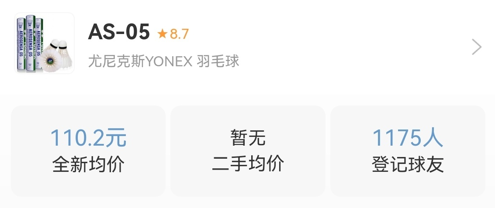

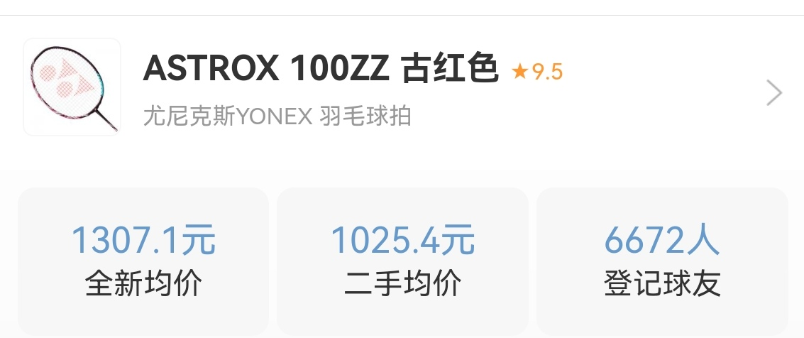
## 不要随意进入别人的场地

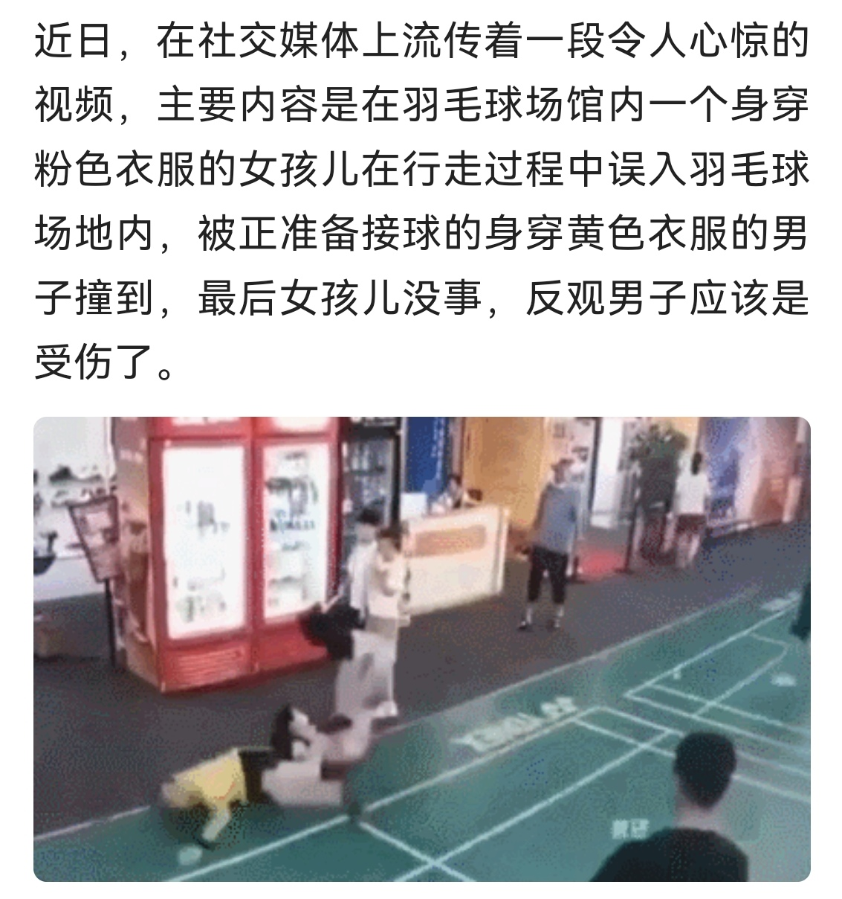

这也是我刚入门时犯过的错误。

首先，安全第一。场内正在全神贯注打球时很难注意到旁边人员的走动，此时突然进入场地很容易挨一拍子，可能造成财产损失不说，万一挨得不轻也很容易造成身体的受伤。而且，即使不被拍子打到，球员在后退过程中和乱入的人发生碰撞也很容易受伤，摔倒、崴脚、甚至是拉伤、骨折等等都有可能发生。当然，即使没受伤遇到脾气暴躁一点的可能把乱入的人打受伤···

其次，这也是很不礼貌的行为，设身处地想想你整合球友激烈对战呢突然窜出来一个人影响了你们，肯定会很不爽。而且，球馆场地基本都是收费的，而且大城市里环境好的场地收费并不便宜，随意进出他人场地影响了别人的打球体验同时也造成了时间和金钱的浪费。

所以，有人随便进入比赛场地时放心的骂他让他长长记性，这是为了他好。

## 清楚打球的目的，不要过于计较

其实除了一些专业比赛，绝大多数球局都是抱着娱乐切磋或者是强身健体的目的进行的，所以为了一个球到底出没出界或者一个发球到底贵不规范而争吵，实在是没必要，不仅伤了和气破坏了打球的好心情，还浪费时间影响周围的人，谁也不能开开心心去打球，球没打成倒揣了一肚子火气回去。

另一方面，既然只是娱乐娱乐，球路刁钻没事，但有时候一些刁钻的球遇上一个拼命的对手很容易造成受伤。就比如双打的时候发后场，在对面经验不足的时候很容易造成崴脚。打球的时候也需要考虑对方的水平和风格，选择避免打一些容易造成受伤的球。毕竟伤病是每个人都不愿意看见的，不要为了输赢丢掉了初衷。而且差距过大时，不要过于炫技一直捡球也没什么体验，高手可以适当放水。

## 少抱怨，少指点，少责怪

标题中的这几种人在球场都不会很受欢迎。刚才说了尽量照顾一下对方的感受，在实力差距过大时为安全着想避免一些危险的球。这就不得不提一些人开打前明说让对方不要留手结果被打爆了还要找各种借口，又是线松了又是手胶脏了，又是场地滑了又是拍子不行了，甚至开始搞一些运气论的玄学来维护脸面。其实打球有输有赢很正常，赢要赢得光彩，输也得输得大方，承认自己技不如人并不困难，为了一点面子不停的叽叽歪歪找各式各样的理由实在很难看。

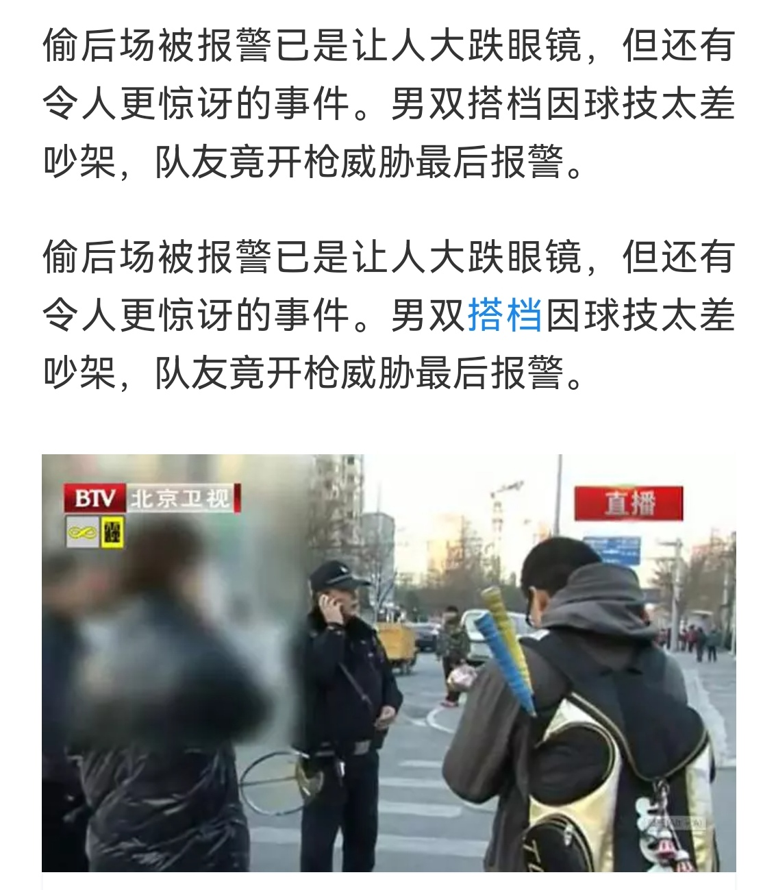

羽毛球不同水平差距很大，于是就有一些高水平的很爱指指点点，每一球都俨然一副“要是我，肯定···”的架子，甚至有一些纸上谈兵的赵括们自己菜的一匹还要啰里啰嗦教人做事。这一点随处可见，也不局限于体育运动，我常常看见很多爱好者唱个歌弹个琴打个游戏写个文章，评论区都“高手云集”“高谈阔论“，不过和这些人并没有什么好争论的，我也希望那些真心热爱的人不要受这些指指点点的影响，遇到说得有理的砸门虚心求教，遇到一些鸡蛋里挑骨头的也不要因为他们的话对自己丢失了信心。回到羽毛球，球场上，遇到别人某个球处理得不好也没必要急于纠正，说不定人家只是一拍的失误，及时确实存在误区，也可以留点面子，打完球聊聊天顺便交流一下技术动作，对方愿意听你愿意讲自然最好，对方不乐意听我们也可以适可而止。

打球不但要有风采，也要有风度，双打怪队友，单打怪对手，这种人我是不愿意和他多打的。“我的我的”，“好球好球”，这些才是球场上应有的良好氛围。

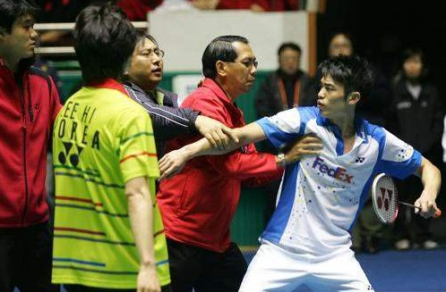

## 积极主动的态度

这一点不必多说，约好几点不要迟到，明明能接的球别杵着不动，势均力敌基础上明明可以好好处理的球别随手乱打，落在自己半场或者网下的球主动去捡，捡了之后尽量从球网的上方轻轻打给对方，别自己不捡在地上拨过去。没打好主动表示歉意，等等这些都是球场的美德。不管如何，认真对待是底线。

## 举手示意的重要

球不小心打到别人了，举手表示歉意；

不小心打飞了对方去捡球，举手表示感谢；

幸运球得分，比如非刻意的滚网球，打到框造成的“超级假动作”，或者慌乱间挥拍蒙了个好球，举手表示“运气运气”；

没注意到对方还没准备好就发球，拒收表示歉意；

自己来电话了鞋带松了等等，举手表示暂停一下等等

## 爱护公共器材

不要把身子压在球网上耍酷！！！不要看大赛结束双方球员都压在网上拥抱握手，人家折腾过后会有人收拾烂摊子的。平时打球场地之后还有人要用，球场压低了之后的人还要再把网收紧，甚至不太方便调整球网姿态的场地后面的球友就只能在压弯了的球网两边打球，很影响体验。  
水啊饮料啊撒在场上一定即使找拖把清理干净，容易打滑且很多饮料会把地面搞得黏糊糊的非常闹心。  
不要摔拍子，自己不想打可以不打，开玩笑性质的把拍子丢地上倒还好，恼羞成怒拿拍子砸球架砸地面的话不仅仅给自己带来损失也容易造成场地或器材的损坏。

## 其他

观看别人打球时避免大吼大叫，尽量保持一定距离避免贴着线站，尽量少做一点负面评价，即使忍不住也小声一点，不然也容易被打。

对方站的比较靠网时注意自己的挥拍，尽量别太暴力，打到人很不好。

用自己的球时不要太怜惜，该换就换别太小气；用别人的球时别嫌弃，捡球温柔一点。

自己热过身了对方才来还是主动邀请对方热身一下，热身时不要打刁钻球，拉拉高远即可。

球打到别人的场地，等别人一球结束再捡，冲进去捡球请三思。

打完挥手再见，彼此觉得有缘分的话可以再拉伸拉伸聊聊天，别扭头就走···

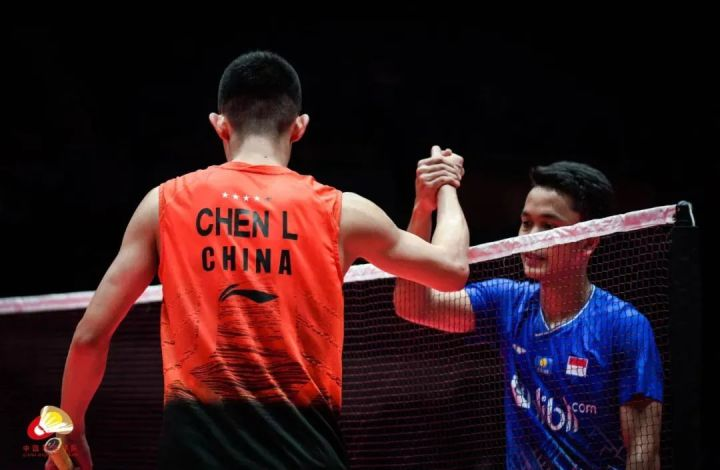

注意着装，光膀子打球尽量先征求一下对方的意见，有异性在场尽量别脱光了···

---

# ***装备记录***

## 尤尼克斯 

### 弓11新色 3UG5

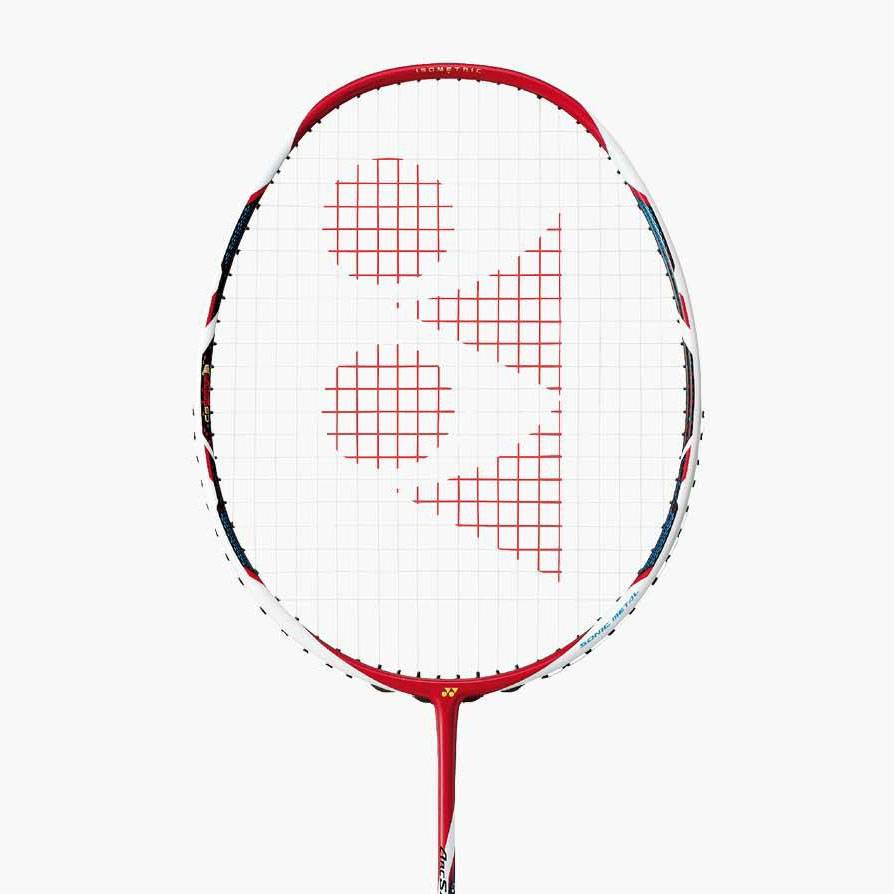

弓11是我第一把3U规格的拍子，也是第一把高端拍，至于为什么第一把选择了她，最重要的因素还是看中了她的颜值。
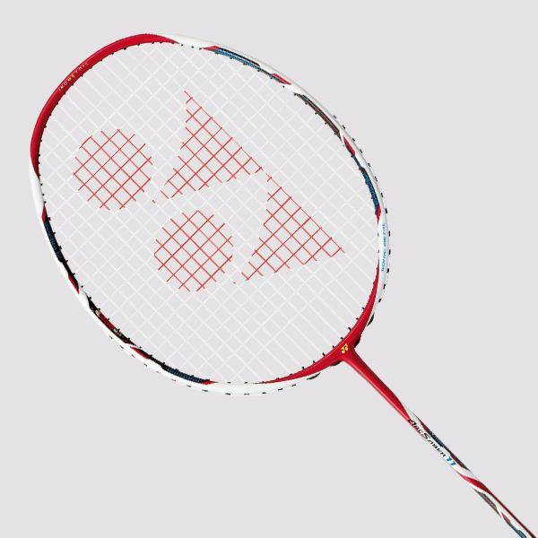

刚穿完线挥动起来还是有点担忧的，并不是立马能够适应，但打了一场之后就深深爱上了。

刚入门就听说遇事不决弓11，果真名不虚传，大拍面配合冷静的脚步能接到不少第一眼以为碰不到的球。  
未完待续···

### 二姐夫原色 4UG5

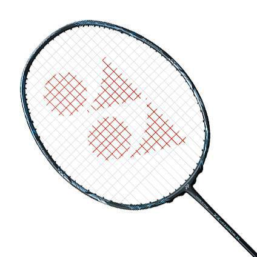

二姐夫，我还未识得她庐山真面目的时候，就已经听说了“断腕神器”的鼎鼎大名。听了各路大神的意见还是没敢轻易尝试。

---

## 胜利 

### 小隼 蓝4UG5 
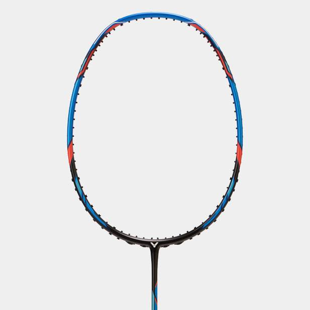

这是我入的第二把中端拍，也许能算得上中高端，但使用感受却不尽人意。尤其我刚入门的时候，这把拍子在知乎、b站等等平台被宣传得神乎其神，甚至被冠以进阶拍性价比首选等等美誉。就从性价比说起，460左右的黑小隼还能跻身高性价比球拍的行列，而因为颜值和传销价格一路高歌猛进甚至售价突破600大关的蓝小隼，在我眼里已经完完全全没有性价比了。 

但不可否认的是，蓝色小隼的颜值确实说得过去，即使不算多么惊艳，也称得上百搭耐看了。  

然而，他与新手似乎并不适配，相对不大的拍框想要打中甜区，对于笨拙的我真的是难上加难，打感也是奇奇怪怪，打不准的话真的每一球像在赌博。刚换上小隼的那一晚，隔几拍就能听到“悦耳”的打铁声，心疼漆水之余更是产生了前所未有的自我怀疑···

### 龙牙之刃 一代新色 3UG5+4UG5+球员版

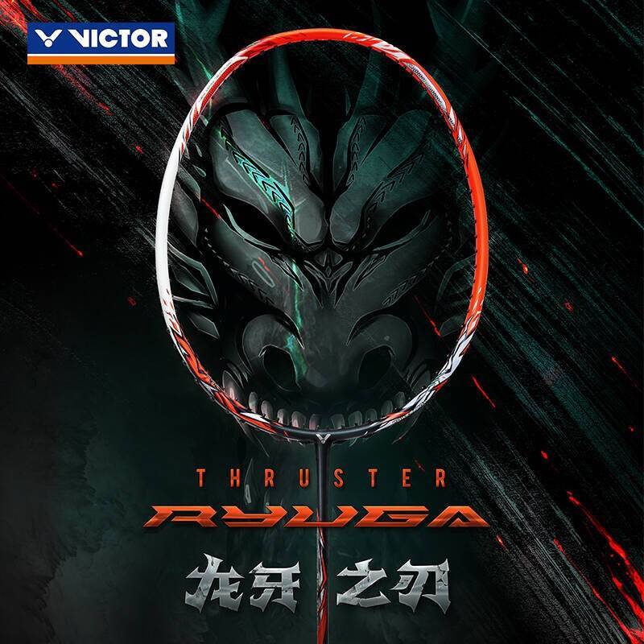

论坛看多了难免对自己产生过高的期待，暗自以为越是门槛高的拍子越能彰显实力之强，越是冠军拍越能表现追求之高，然而真正上手了才知道自己还是菜狗一只。龙牙之刃对于现在的我就是如此，简直是洛基遇见雷神锤，根本使不动。之前从未体验过的巨大挥重让我直接选择了不穿线丢橱柜里吃灰。

除了认清自身之外，龙牙这把拍子的鉴定之路也让我收获不少。国行的胜利都是可以在微信公众号扫码鉴定的，但海外版却走不通这条路，而中羽许多大佬钟情yy对胜利帖子往往爱搭不理，这就导致了海外版的胜利拍很难做到确定正品。而这次通过与南大和园开货梯与老板的交流，我了解到，除了观察拍锥处贴纸在不同角度下的双V之外，还可以通过线钉来加以确认。我暂时对线钉没有什么观察和了解，只是匆匆听见老板说yy线钉做的比较潦草，而李宁和胜利的线钉往往做的比较规范。这一辨认技巧我多加了解之后再找机会分享给大家。

另外还有一个不大可靠的判别方法。正品“店大欺客”往往不会很在意一些无关紧要的细节，经常出现T头处v有点歪，甚至是钢号有点偏的情况，所以常常遇到标或者钢号有点歪的情况不必着急，很可能只是大厂有点散漫罢了。

落灰两周多后和学校对面羽球店老板交流了一番，老板恰好认识个朋友想要龙二换龙一，我寻思着落灰也是落灰，不如换一把能打的算了，于是与龙牙之刃一代的第一段短暂缘分就告一段落了···

更新：然而过了没多久，我又入了一把4U的龙一，这次发现很好上手，不清楚究竟是我水平提高了还是3U和4U真的差距很大。还入了一把辣子鸡钢号的，暂未使用。

### 龙牙之刃 二代 3UG5

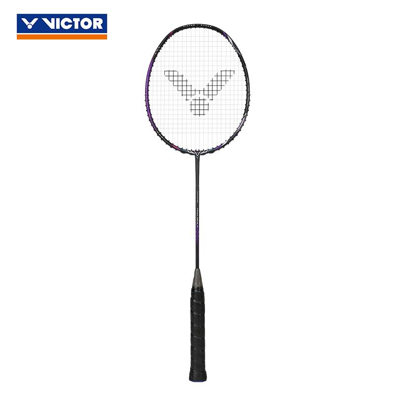

上面也提到了，这把拍子是我用龙牙一换来的。这里不得不提一下别人对这把拍子的看法。

常见说法：进攻性较龙一有所下滑，但控制等方面更轻松了。4u龙二类似平衡拍，硬度类似白爪，比黑隼进攻性略强。但漆水脆，且论坛上出现较大规模的拍头断裂情况。

拿到手，黑紫配色的颜值还是很惊艳的，虽然没有很多细节的雕琢，但总体看上去自带一股神秘的霸气。刚上手感觉非常奇怪，一方面这把拍子的前任拉了整整28磅，是我向来不敢企及的高度，刚上手打起来甚至连高远球都不知道怎么打了。另一方面，我也是第一次使用这种新型的手柄，击球时的反馈也有不小的区别。

借给同学用了半小时，他评价说这拍子还是很好用的，但是去底之后头重感跟一代仍然不是一个档次。

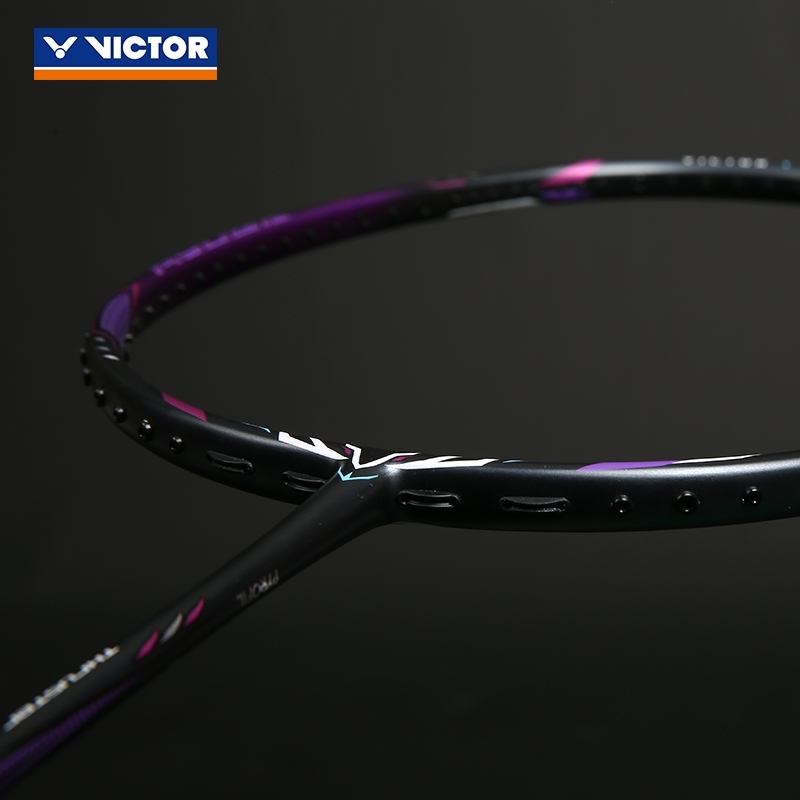

### 极速11 4UG5

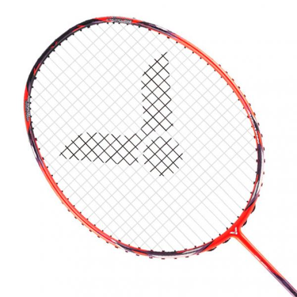

双十一打折时入的，这拍子夹在极速10和极速12之间一直不温不火，中杆材质没有采用百洛碳，因此手感和10,12俩兄弟差别很大，整个拍子很硬，处处都硬，甚至我没去底胶缠了手胶之后还能感受到一点点震手，不过相应的出球也很干脆。

颜色没有想的那么好看，有一丢丢亮过头了。

---

## 李宁  

### 锋影500 4UG5 

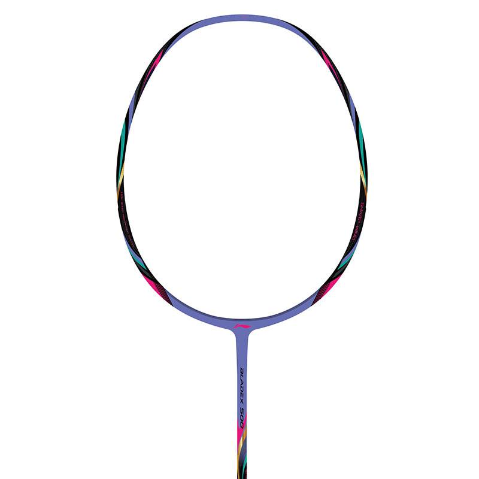

我正式入门后的第一把拍子，也是我爸给我买的，配色我超喜欢，当时用起来也非常舒适。

拍子本身比较轻，各方面对于新手都完全够用了，不过用着用着能渐渐感受到下压不是很容易。

## 其他品牌

### 波力 J20-010 4UG5

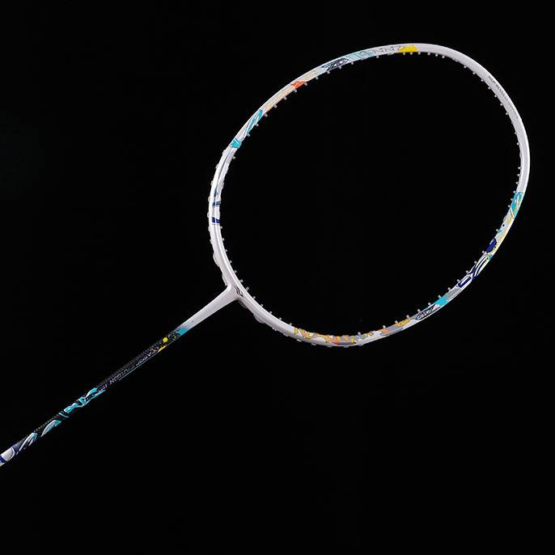

冲着颜值去的，这种白色打底的涂鸦风格深入我心。但令我惊喜的是这把拍子对于我这个新手来说意外地适配，甚至下压球要比锋影500更容易一些。

### 击破 TK70 4UG5

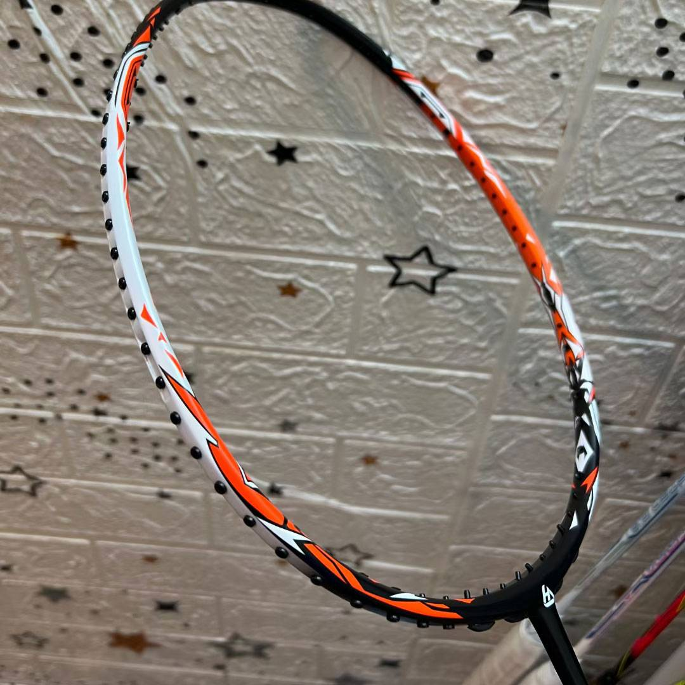

鸡牙之刃,击破这个品牌也是反复出现在眼前，高性价比和大厂平替似乎成了她最密不可分的标签。不论是听这把拍子的外号还是看她的外观，都是满满的山寨版龙牙之刃的感觉。

首先，如果打感上真能仿出九成以上的相似度，这是厂家的真材实料的表现，然而即便如此，外观上直接赤裸裸地抄袭在我眼里也是不可取的，抄袭自然是往好的抄，所以在我眼里抄袭本身就给我一种在主动承认做的没人家好并且不抄就不会做的感觉。

不过，值得肯定的是，拍子打起来确实说得过去，确实能有一丢丢高端拍的感觉，但被动球并不好接，快速的对抽也不占优势，何况我这把还是4U。但后场发起力来还是很给力的。

