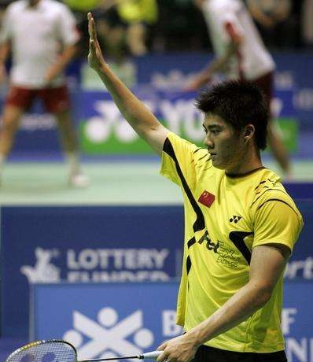
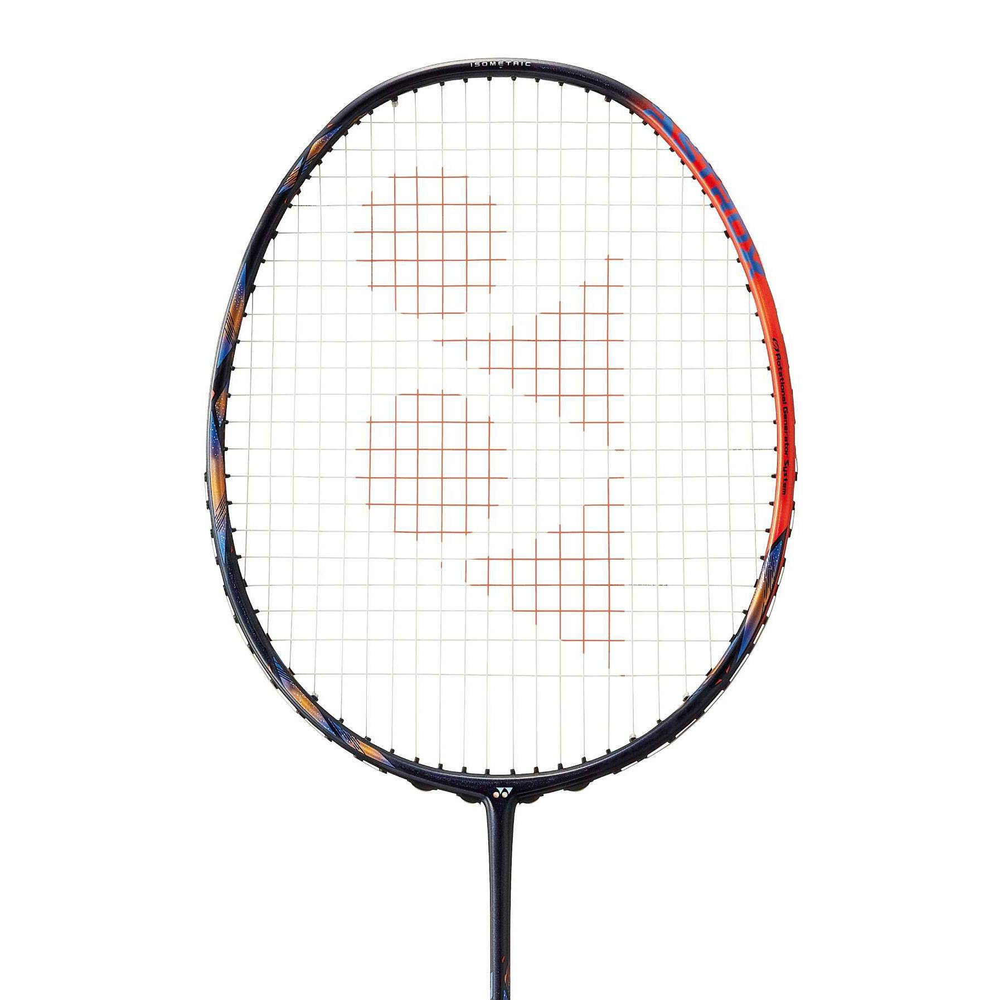
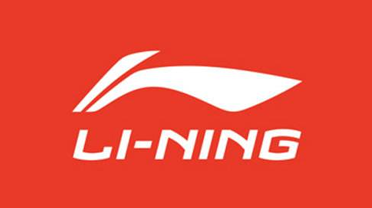
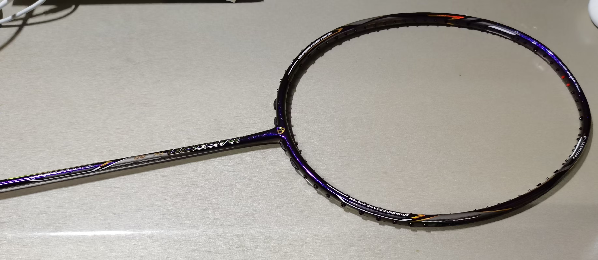

# ***序***

我并非在做测评，更不是打广告，只是真实地记录下自己不同阶段的使用感受，偶尔回顾起来也能感受到成长。这一篇文章，就请各位看做一个普通爱好者的一点牢骚吧。

---

# ***选拍指南***

选拍讲究合适，当自己水平提高逐渐确定喜欢的打法后就可以自己挑选心仪的球拍了，萝卜青菜各有所爱，喜不喜欢自己打了才知道。所以这里的选拍指南只是给刚入门的球友们提供一些思路。

## 简易总结：价格+颜值+重量

1. 根据用途和预算选择合适价位（应付体育课？放松身心？入门这项运动？）

2. 选择自己喜欢的颜值

3. 选择适合自己的重量

## 视频推荐

可以看看这位up猪的球拍选购指南：[胖虎憨憨z](https://space.bilibili.com/395971280/)

这位up主的一些高端拍测评也可以借鉴一下：[Dadelion](https://space.bilibili.com/7755602/)

还有这位up主会解说一些经典比赛我也很喜欢：[生活家阿童](https://space.bilibili.com/37665365/)

想系统学习羽毛球但又囊中羞涩可以看看陈金老师和李宇轩老师的网课（虽然李宇轩老师网课价格也相对很高）~~实在不行选择一些自己承担的起的渠道先看日后富裕了再支持正版吧~~:[李宇轩教练](https://space.bilibili.com/519050265/)

## 购买须知

想要以一个适合的甚至是美丽的价格买拍子还是需要做一些功课的。

1. 下载中羽在线，参考均价和最近几个月球友们的入手价格，买拍时若店铺价格明显偏高时可尝试询问中羽价。所谓中羽价，我自己的理解是，商家肯定赚的越多越高兴，但你报了中羽的名号之后商家会认为该定啥价你都清楚了，赚不了智商税，因此会给出更合适的价格。

2. 了解一些影响价格的因素，规格、版本、成色等等

3. 保持好心情，理性消费

---

# ***球场礼貌***

这一点我在刚入门时没有重视，导致出现了不少现在回想起来很二的操作，所以我觉得有必要讲一讲，内容主要是胖虎视频里讲的，掺杂了一些自己打球的体会。

## 自带球拍和球

很多不太了解球拍价格的球友很容易一开口就借四位数的拍子，这不仅让拍子的主人很难办，而且万一出现打掉漆甚至是打断打裂之类的情况也很棘手，甚至可能会引起更大的纠纷。而羽毛球的价格也一度颠覆我的认知，入门前曾以为蹭一两个球很正常很无所谓，知道自己买才发现，50以上一桶都是常态，更有一百多的（甚至三四百的···），仅仅一只球就来到了十几元以上的价格，这对于学生并不便宜，甚至是一顿饭的钱了。所以，除了极其特殊的情况，尽量别借拍子或者直接蹭球
~~（除非对方非常乐意）~~

举个栗子

## 不要随意进入别人的场地

这也是我刚入门时犯过的错误。

首先，安全第一。场内正在全神贯注打球时很难注意到旁边人员的走动，此时突然进入场地很容易挨一拍子，可能造成财产损失不说，万一挨得不轻也很容易造成身体的受伤。而且，即使不被拍子打到，球员在后退过程中和乱入的人发生碰撞也很容易受伤，摔倒、崴脚、甚至是拉伤、骨折等等都有可能发生。当然，即使没受伤遇到脾气暴躁一点的可能把乱入的人打受伤···

其次，这也是很不礼貌的行为，设身处地想想你整合球友激烈对战呢突然窜出来一个人影响了你们，肯定会很不爽。而且，球馆场地基本都是收费的，而且大城市里环境好的场地收费并不便宜，随意进出他人场地影响了别人的打球体验同时也造成了时间和金钱的浪费。

所以，多绕几步吧别像我一样被骂···

## 清楚打球的目的，不要过于计较

一般除了一些专业比赛，绝大多数球局都是抱着娱乐切磋或者是强身健体的目的进行的，所以为了一个球到底出没出界或者一个发球是不是规范而争吵，实在是没必要，不仅伤了和气破坏了打球的好心情，还浪费时间影响周围的人，谁也不想开开心心去打球，球没打成倒揣了一肚子火气回去。

另一方面，既然只是娱乐娱乐，球路刁钻没事，但有时候一些刁钻的球遇上一个拼命的对手很容易造成受伤。就比如双打的时候发后场，在对面经验不足的时候很容易造成崴脚。打球的时候也需要考虑对方的水平和风格，避免打一些容易造成对方受伤的球。伤病是每个羽球人都不愿看见的，适当放水并非轻视，而是保护···

## 少抱怨，少指点，少责怪

技不如人大方承认，找各种借口又是线松了又是手胶脏了，又是场地滑了又是拍子不行了，甚至开始搞一些运气论的玄学来维护脸面实在有些尴尬。打球必然有输有赢，赢要赢得光彩，输也得输得大方。

指指点点想必大家都不陌生，我自认为羽毛球是一个当局者清旁观者迷的运动，很多时候自己也知道怎么处理更好，但快速的节奏很难让人边想边打，犯一些错误也在所难免。倘若球友及时确实存在很大误区，可以打完球聊聊天顺便交流一下技术动作，对方愿意听你愿意讲自然最好，对方不乐意听我们也可以适可而止。双打别怪队友，单打别怪对手，“我的我的”，“好球好球”，这些才是球场上应有的良好氛围。

## 积极主动的态度

约好几点不要迟到，能接的球别杵着不动，别一时脾气上来了就随手乱打，落在自己半场或者网下的球主动去捡，捡了之后尽量从球网的上方轻轻打给对方，没打好主动表示歉意，等等这些都是球场的美德。不管如何，认真对待是给对方基本的尊重。~~王之蔑视除外~~

## 举手示意的重要

球不小心打到别人了=举手+对不起；

不小心打飞了对方去捡球=举手+我的我的；

幸运球得分=举手+运气运气；

没注意到对方还没准备好就发球=举手+不好意思；

自己来电话了鞋带松了等等=举手+稍等一下

## 爱护公共器材

别压球网别压球网别压球网！！！

水啊饮料啊撒了自己主动清理掉

别摔拍子别乱扔杂物在球场上

## 其他

观看别人打球时避免大吼大叫，尽量保持一定距离避免贴着线站，尽量少做一点负面评价，即使忍不住也小声一点，不然也容易被打。

双方站的都比较靠网时注意自己的挥拍，别太暴力防止打到对手。

用自己的球时大方一点，球破损了询问对方要不要换个球；用别人的球时别太嫌弃···

主动邀请对方热身一下 ~~（哪怕自己已经热过身了）~~，热身时不要打刁钻球。

球打到别人的场地，等别人这一球结束再捡。

打完挥手再见，彼此觉得有缘分的话可以再拉伸拉伸聊聊天···

注意着装，光膀子打球尽量先征求一下对方的意见，有异性在场尽量别脱光了···

---

# ***装备记录***

## 球拍

### 尤尼克斯 

#### 弓箭系列

##### 弓11新色 3U

弓11是我第一把3U规格的拍子，也是第一把高端拍，至于为什么第一把选择了她，最重要的因素还是看中了她的颜值。

刚穿完线挥动起来还是有点担忧的，并不是立马能够适应，但打了一场之后就深深爱上了。

刚入门就听说遇事不决弓11，果真名不虚传。虽然后来接触到一些拍子自认为比弓11好打，但还是放不下她。也有人称yy在弓11之后再无平衡拍，虽说略有夸张，但也能侧面反映弓11实力之强。~~（也可能是yy在摆烂）~~

#### 威力系列

##### 二姐夫原色 4U

二姐夫，我还未识得她庐山真面目的时候，就已经听说了“断腕神器”的鼎鼎大名。听了各路大神的意见还是没敢轻易尝试。空拍一直留存至今，还没有尝试过。自己掰了掰中杆，确实硬得离谱，尤其是之后和其他拍子比较之后越发感受到这硬度的可怕。不过光是掰也说不准，毕竟没打过。

#### 锐速系列

##### ZSP橙色 3U

好用，除了刚上手容易打框其他什么我都觉得很好，还记得那天晚上在快递站收到她后拆开一看，整个拍框和yy标在月色下闪闪发光的样子，是恋爱的感觉没错了。

#### 天斧系列

##### 天斧77pro 3U

颜值比我想的好看一点，3U比我想的重不少，但打起来并不费力。更多的评价等待之后体验充足再说吧。

##### 天斧100zz老色 3U

因为是买的二手，上一位大佬拉了整整28磅，驾驭不了，高远球都有点打不明白了，反手被动球更是直接不会接了，暂时不太清楚究竟是3U的规格的问题还是28磅的问题，当然，也是我水平太低的问题。

另外，中杆是真的很短，跟77pro放在一起时，可以明显看出中杆短了一截，我还不太清楚这个设计的用意是什么。

##### 天斧100zz新色 4U

首先不得不说的是，我本来看图片觉得新色比老色更好看一些，可拿到手发现根本不是这回事，新色其实鲜艳的红色很少，更多的是那种棕红棕红的，拿在手里有点点老气。

这一把也是二手淘的，前任拉的27磅65线，打起来比3U28磅的同款轻松许多，个人觉得挺好上手的。听人说这拍子打滑板很难，然而我不会滑板···所以没发现什么缺点。但实话实说，限于目前的水平，我也不太能感受到这把拍子的特殊之处。~~（除了不便宜）~~

#### 疾光系列

暂未用过···

#### 双刃系列

暂未用过···

---

### 胜利 

#### TK系列

##### 小隼 蓝4U （已出）

这是我入的第二把中端拍，也许能算得上中高端，但使用感受却不尽人意。尤其我刚入门的时候，这把拍子在知乎、b站等等平台被宣传得神乎其神，甚至被冠以进阶拍性价比首选等等美誉。就从性价比说起，四百多左右的小隼还能跻身高性价比球拍的行列，而售价突破600大关的小隼，我实在找不出一个推荐的理由。 

但不可否认的是，这个小隼的颜值我很喜欢，蓝黑橙都是我比较喜欢的颜色。

然而，他与新手似乎并不适配，相对不大的拍框想要打中甜区对于笨拙的我真的是难上加难，打感也是奇奇怪怪，每一次发力，出球却像在赌博，经常出现我发力后自认为会很快的球反而有点软绵绵的情况。刚换上小隼的那一晚，隔几拍就能听到“悦耳”的打铁声，心疼之余更是产生了前所未有的自我怀疑···

##### 龙牙之刃 一代新色 3U（已出）+ 4U + 3U球员版

论坛看多了难免对自己产生过高的期待，暗自以为越是门槛高的拍子越能彰显实力之强，然而真正上手了才知道自己还是菜狗一只。龙牙之刃对于现在的我就是如此，简直是洛基遇见雷神锤，根本使不动。之前从未体验过的巨大挥重让我直接选择了不穿线丢橱柜里吃灰。

落灰两周多后和学校对面羽球店老板交流了一番，老板恰好认识个朋友想要龙二换龙一，我寻思着落灰也是落灰，不如换一把能打的算了，于是与龙牙之刃一代的第一段短暂缘分就告一段落了···

更新：然而过了没多久，我又入了一把4U的龙一，这次发现很好上手，不清楚究竟是我水平提高了还是3U和4U真的差距很大。还入了一把辣子鸡钢号的，暂未使用。

再次更新：用了还是有点失望，3U很猛但我目前打不动，4U又没啥特点，杀球就那样，我个人认为甚至还不如我的其他几把拍子···而且性价比真的很惨。而且，漆水本身看上去还说得过去，但当我把他和弓11、100zz、zsp等拍子放一起的时候，能明显感觉这把龙牙的颜值有点不大行，我自己觉得有些可以简单点的地方搞得很杂乱，有些可以点缀的地方却空荡荡，不好看。

LZJ的球风我还是很喜欢的，太猛了太猛了，争取提升自己的实力驾驭这一把龙牙吧。

##### 龙牙之刃 二代 3U

上面也提到了，这把拍子是我用龙牙一换来的。

论坛上有很多说这把拍子T头容易断的，这我不知道，至少我手上这个挺结实。

拿到手，黑紫配色的颜值还是很惊艳的，虽然没有很多细节的雕琢，但总体看上去自带一股神秘的霸气。刚上手感觉非常奇怪，一方面这把拍子的前任拉了整整28磅，是我向来不敢企及的高度，刚上手打起来甚至连高远球都不知道怎么打了。另一方面，我也是第一次使用这种新型的手柄，击球时的反馈也有不小的区别。

渐渐地，随着我水平提高，我也越来越喜欢这把拍子，超级好用，没那么大负担，能明显感受到她的弹，下压也足够我用，尤其上了更适合我的26磅线之后非常舒适。

#### 极速系列

##### 极速11 4U（已出）

双十一打折时入的，这拍子夹在极速10和极速12之间一直不温不火，中杆材质没有采用百洛碳，因此手感和10,12俩兄弟差别很大，整个拍子很硬，处处都硬，甚至我没去底胶缠了手胶之后还能感受到一点点震手。

颜色没有想的那么好看，有一点单调，远看上去就是红红的一团。打感并没有什么不满意的地方，主要是自己更喜欢单打，就逐渐将这把拍子冷落了。

#### 神速系列

神速90K二代 3U

暂未上手，颜值我喜欢。

#### 驭系列

暂未用过···

#### 亮剑系列

暂未用过···

#### HX系列

暂未用过···

#### 挑战者系列

暂未用过···

#### 尖峰系列

暂未用过···

#### 哥伦比亚系列

暂未用过···

---

### 李宁  

#### 锋影系列

##### 锋影500 4U 

我正式入门后的第一把拍子，也是我爸给我买的，配色我超喜欢，当时用起来也非常舒适。

拍子本身比较轻，各方面对于新手都完全够用了，不过用着用着能渐渐感受到下压不是很容易。

#### 雷霆系列

蹭过一次雷霆80，很好用，但毕竟只用了一小会儿，不多做评价。

#### 能量系列

暂未用过···

#### 风动系列

暂未用过···

#### 风刃系列

暂未用过

#### N系列（风林火山系列）

暂未用过···

#### BP+TP+TB系列

暂未用过···

#### 突袭系列

暂未用过···

#### WS风暴系列

暂未用过····

#### HC+UC系列

暂未用过···

---

### 其他品牌

#### 波力

##### 波力 J20-010 4U

冲着颜值去的，这种白色打底的涂鸦风格深入我心。但令我惊喜的是这把拍子对于我这个新手来说意外地适配，甚至下压球要比锋影500更容易一些。

#### 击破

##### 击破 TK70 4U（已出）

鸡牙之刃,击破这个品牌也是反复出现在眼前，高性价比和大厂平替似乎成了她最密不可分的标签。不论是听这把拍子的外号还是看她的外观，都是满满的山寨版龙牙之刃的感觉。

首先，如果打感上真能仿出九成的相似度，这是厂家的真材实料的表现，然而即便如此，外观上直接赤裸裸地抄袭在我眼里也是不可取的，抄袭自然是往好的抄，所以在我眼里抄袭本身就给我一种在主动承认做的没人家好并且不抄就不会做的感觉。

不过，值得肯定的是，拍子打起来确实说得过去，但和龙牙的中杆还是能明显感到差距的，个人感觉称不上平替，但同价位确实非常香。

##### 击破 TK80 白 4U

暂未使用，颜值我喜欢。

##### 击破 TK90 紫 3U（已出）

说实话，击破的拍子不是不好，只是我对他们有太大期待，很多网友表示击破比三大厂高端拍还好打，但我个人觉得击破只是性价比占优势，实际上打感并不能做到大厂水准，换句话说，大厂涨价飞快，不然高端拍维持在三位数价格的话可能击破不会有这么多爱好者···

---

个人喜好排序（注意是个人喜好,综合了一点性价比的因素）：

 * T0：

 >Ax100zz(4U) 龙二(3U) ZSP(3U)

 * T1：

 >弓11(3U) Ax77Pro(3U) 锋影500(4U) 波力j20(4U) 100zz(3U)

 * T2: 
 
 >龙一(3U) 龙一(4U) 极速11d(4U) 击破TK90(3U) 击破TK70(4U)

 * T3: 
 
 >小隼

 个人未来可能会入的拍：（注意是未来，注意是可能）

 >88DP 黑金隼 雷霆80 雷霆90龙 雷霆90虎 战戟8000 双刃10 NF800LT N901 N551 N501 LDF VT80 风刃900B 击破dzs 击破gs 击破b10b11···

 ---

## 球鞋

### 变色龙 Ranger 3.0 TD

这个价位，说不出什么缺点···虽然确实缓震型防滑性支撑性包裹性都不强，但也对得起这个价格了,就是平时干苦力穿着玩玩的。

### 雲霆zn

鞋底很舒服缓震很好，包裹性也很强，而且不重。然而鞋舌旁边一块非常不耐磨，而且并不怎么防崴脚，但崴脚时还是有一定保护作用，我崴了一次一点事没有。总体而言很喜欢，可惜那一抹金色让我对颜值有些不满···

### S82一代

不重，颜值比图片看上去好一些。底相较于雲霆zn略硬，包裹性有，但不是很强，长时间穿脚底有点疼。我自己觉得美中不足的地方是前脚掌脚面处加了绒保暖，但脚底略有点单薄，脚后跟倒是不错。

将来可能会入的球鞋：
>p9200二代TTY A970

# ___写在最后___

暂时还不知道该说什么···先祝愿大家身体健康吧。

